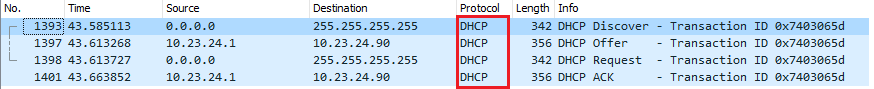
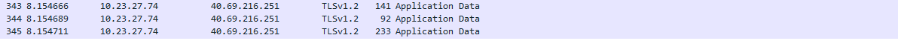

## 1.a.Анализ сетевых интерфейсов
1) Исследовать сетевые настройки на вашем компьютере. Выполнить проверку относительно 
всех доступных сетевых интерфейсов в системе. (ipconfig / ifconfig / ip).
```
vagrant@task1:~$ ip a
1: lo: <LOOPBACK,UP,LOWER_UP> mtu 65536 qdisc noqueue state UNKNOWN group default qlen 1000
    link/loopback 00:00:00:00:00:00 brd 00:00:00:00:00:00
    inet 127.0.0.1/8 scope host lo
       valid_lft forever preferred_lft forever
    inet6 ::1/128 scope host
       valid_lft forever preferred_lft forever
2: enp0s3: <BROADCAST,MULTICAST,UP,LOWER_UP> mtu 4444 qdisc fq_codel state UP group default qlen 1000
    link/ether 02:57:a3:c3:eb:b7 brd ff:ff:ff:ff:ff:ff
    inet 10.0.2.15/24 brd 10.0.2.255 scope global dynamic enp0s3
       valid_lft 86298sec preferred_lft 86298sec
    inet6 fe80::57:a3ff:fec3:ebb7/64 scope link
       valid_lft forever preferred_lft forever
3: enp0s8: <BROADCAST,MULTICAST,UP,LOWER_UP> mtu 5555 qdisc fq_codel state UP group default qlen 1000
    link/ether 08:00:27:99:fc:18 brd ff:ff:ff:ff:ff:ff
    inet 10.23.26.135/22 brd 10.23.27.255 scope global dynamic enp0s8
       valid_lft 259118sec preferred_lft 259118sec
    inet6 fe80::a00:27ff:fe99:fc18/64 scope link
       valid_lft forever preferred_lft forever
```
2) Проверить качество связи (на домены ukr.net, ya.ru, 8.8.8.8), объяснить показатели. (ping).
ukr.net
```
vagrant@task1:~$ ping -c 5 ukr.net
PING ukr.net (212.42.76.252) 56(84) bytes of data.
64 bytes from srv252.fwdcdn.com (212.42.76.252): icmp_seq=1 ttl=53 time=38.8 ms
64 bytes from srv252.fwdcdn.com (212.42.76.252): icmp_seq=2 ttl=53 time=38.8 ms
64 bytes from srv252.fwdcdn.com (212.42.76.252): icmp_seq=3 ttl=53 time=38.9 ms
64 bytes from srv252.fwdcdn.com (212.42.76.252): icmp_seq=4 ttl=53 time=38.2 ms
64 bytes from srv252.fwdcdn.com (212.42.76.252): icmp_seq=5 ttl=53 time=38.9 ms
--- ukr.net ping statistics ---
5 packets transmitted, 5 received, 0% packet loss, time 4056ms
rtt min/avg/max/mdev = 38.254/38.789/38.993/0.299 ms
```
ya.ru
```
vagrant@task1:~$ ping -c 5 ya.ru
PING ya.ru (87.250.250.242) 56(84) bytes of data.
64 bytes from ya.ru (87.250.250.242): icmp_seq=2 ttl=51 time=21.5 ms
64 bytes from ya.ru (87.250.250.242): icmp_seq=3 ttl=51 time=21.3 ms
64 bytes from ya.ru (87.250.250.242): icmp_seq=4 ttl=51 time=21.5 ms
64 bytes from ya.ru (87.250.250.242): icmp_seq=5 ttl=51 time=21.5 ms
--- ya.ru ping statistics ---
5 packets transmitted, 4 received, 20% packet loss, time 4117ms
rtt min/avg/max/mdev = 21.390/21.508/21.565/0.162 ms
```
8.8.8.8
```
vagrant@task1:~$ ping -c 5 8.8.8.8
PING 8.8.8.8 (8.8.8.8) 56(84) bytes of data.
64 bytes from 8.8.8.8: icmp_seq=1 ttl=49 time=28.9 ms
64 bytes from 8.8.8.8: icmp_seq=2 ttl=49 time=30.8 ms
64 bytes from 8.8.8.8: icmp_seq=3 ttl=49 time=24.7 ms
64 bytes from 8.8.8.8: icmp_seq=4 ttl=49 time=27.9 ms
64 bytes from 8.8.8.8: icmp_seq=5 ttl=49 time=27.3 ms
--- 8.8.8.8 ping statistics ---
5 packets transmitted, 5 received, 0% packet loss, time 4027ms
rtt min/avg/max/mdev = 24.703/27.962/30.819/2.008 ms
```
3) Проверить качество связи (на host студента), максимально нагрузить host. (ping)
```
sudo ping -M do -s 1472 -l 100 -f -i 0 <ip address>
```
4) Изучение MTU:
- получить значения MTU локальных интерфейсов;
```
vagrant@task1:~$ ip a | grep -E "^[1-9]*:" | cut -d' ' -f 2,4,5
lo: mtu 65536
enp0s3: mtu 1500
enp0s8: mtu 1500
```
- изменить  значение  MTU  локальных  интерфейсов.  Определить  допустимые значения MTU. Как это отразится на канале связи? 
```
vagrant@task1:~$ sudo ip link set mtu 4444 dev enp0s3
vagrant@task1:~$ sudo ip link set mtu 5555 dev enp0s8
vagrant@task1:~$ ip a | grep -E "^[1-9]*:" | cut -d' ' -f 2,4,5
lo: mtu 65536
enp0s3: mtu 4444
enp0s8: mtu 5555
```
- включите режим Jumbo Frame. Промоделировать преимущества и недостатки;
```
vagrant@task1:~$ sudo ip link set mtu 9999 dev enp0s3
vagrant@task1:~$ sudo ip link set mtu 16000 dev enp0s8
vagrant@task1:~$ ip a | grep -E "^[1-9]*:" | cut -d' ' -f 2,4,5
lo: mtu 65536
enp0s3: mtu 9999
enp0s8: mtu 16000
```
- Объединиться в команды по 3 студента. Два члена команды на своих VM изменяют MTU  и  
не  сообщают  его  третьему  участнику.  Третий  член  команды  должен вычислить MTU канала связи. (Описать процесс вычисления). 
Все члены команды должны написать свой скрипт для поиска MTU и выполнить поиск MTU;
```
Select the starting package size.
If it sent successfully, select a larger packet size.
If the package does not receive, then reduce its size by 1 byte until it passes.
```
```
vagrant@EPUAKHAW013DT11:~$ python3 mtu_scanner.py 8.8.8.8
MTU is 1500
```
- измените длину очереди передачи и промоделируйте ее работу после изменений. Сделайте несколько изменений.

Изменение qlen
```
vagrant@networks1:~$ sudo ip link set qlen 2000 dev enp0s8
```
5) Изучение MAC.
- Найти все доступные MAC-адреса в вашей сети (хосты коллег, ресурсов).

arp
```
vagrant@EPUAKHAW013DT11:~$ sudo arp-scan --interface=enp0s8 --localnet | grep -v '(Unknown)'
Interface: enp0s8, datalink type: EN10MB (Ethernet)
Starting arp-scan 1.9 with 1024 hosts (http://www.nta-monitor.com/tools/arp-scan/)
10.23.24.22     00:02:4e:15:b7:35       Datacard Group
10.23.24.45     08:00:27:96:61:92       CADMUS COMPUTER SYSTEMS
10.23.24.49     08:00:27:49:0a:dc       CADMUS COMPUTER SYSTEMS
10.23.24.57     08:00:27:1f:4a:e6       CADMUS COMPUTER SYSTEMS
10.23.24.63     08:00:27:8c:22:c1       CADMUS COMPUTER SYSTEMS
10.23.24.81     a8:20:66:23:b2:7d       Apple Inc
10.23.24.75     a8:20:66:4a:ae:5d       Apple Inc
10.23.24.77     00:e0:4c:31:2e:6c       REALTEK SEMICONDUCTOR CORP.
10.23.24.116    08:00:27:32:f5:c4       CADMUS COMPUTER SYSTEMS
10.23.24.130    68:5b:35:af:cd:bd       Apple inc
10.23.24.172    08:00:27:c7:03:e9       CADMUS COMPUTER SYSTEMS
10.23.24.168    e8:e0:b7:e6:07:57       Toshiba
10.23.24.178    08:00:27:9b:06:ed       CADMUS COMPUTER SYSTEMS
10.23.24.182    00:24:9b:0b:1c:bf       Action Star Enterprise Co., Ltd.
10.23.24.192    00:21:b7:4f:71:01       Lexmark International Inc.
10.23.24.199    08:00:27:ce:e8:6f       CADMUS COMPUTER SYSTEMS
10.23.26.4      00:e0:4c:68:03:20       REALTEK SEMICONDUCTOR CORP.
10.23.26.30     08:00:27:a2:e0:3a       CADMUS COMPUTER SYSTEMS
10.23.26.36     08:00:27:50:7a:80       CADMUS COMPUTER SYSTEMS
10.23.26.19     b8:27:eb:19:fb:89       Raspberry Pi Foundation
10.23.26.7      30:f9:ed:57:60:c9       Sony Corporation
10.23.26.11     3c:d9:2b:a3:06:fe       Hewlett-Packard Company
10.23.26.12     2c:27:d7:11:cd:60       Hewlett-Packard Company
10.23.26.48     08:00:27:8c:32:c3       CADMUS COMPUTER SYSTEMS
10.23.26.66     00:0a:cd:31:30:74       Sunrich Technology Limited
10.23.26.68     08:00:27:70:93:c5       CADMUS COMPUTER SYSTEMS
10.23.26.58     10:dd:b1:9e:25:9f       Apple
10.23.26.82     08:00:27:81:bd:9f       CADMUS COMPUTER SYSTEMS
10.23.26.85     00:11:85:75:f1:74       Hewlett-Packard Company
10.23.26.108    08:00:27:41:f3:a9       CADMUS COMPUTER SYSTEMS
10.23.26.140    08:00:27:a1:c8:e1       CADMUS COMPUTER SYSTEMS
10.23.26.141    08:00:27:29:e8:04       CADMUS COMPUTER SYSTEMS
10.23.26.143    08:60:6e:81:76:e8       ASUSTek COMPUTER INC.
10.23.26.146    08:00:27:66:19:07       CADMUS COMPUTER SYSTEMS
10.23.26.154    08:00:27:a6:6a:f4       CADMUS COMPUTER SYSTEMS
10.23.26.158    08:00:27:62:86:ea       CADMUS COMPUTER SYSTEMS
10.23.26.159    08:00:27:62:86:ea       CADMUS COMPUTER SYSTEMS
10.23.26.156    08:00:27:25:ba:3f       CADMUS COMPUTER SYSTEMS
10.23.26.162    08:00:27:86:cc:be       CADMUS COMPUTER SYSTEMS
```
- Реализовать систему автоматического обнаружения изменений в локальной сети. 
```
vagrant@EPUAKHAW013DT11:~$ watch -n 1 -d "sudo arp-scan --interface=enp0s8 --localnet | grep -v '(Unknown)' | sort"

Every 1.0s: sudo arp-scan --interface=enp0s8 --localnet | grep -v '(Unknown)'   
Interface: enp0s8, datalink type: EN10MB (Ethernet)
Starting arp-scan 1.9 with 1024 hosts (http://www.nta-monitor.com/tools/arp-scan/)
10.23.24.22     00:02:4e:15:b7:35       Datacard Group
10.23.24.57     08:00:27:1f:4a:e6       CADMUS COMPUTER SYSTEMS
10.23.24.75     a8:20:66:4a:ae:5d       Apple Inc
10.23.24.66     00:e0:4c:36:07:2e       REALTEK SEMICONDUCTOR CORP.
10.23.24.81     a8:20:66:23:b2:7d       Apple Inc
10.23.24.116    08:00:27:32:f5:c4       CADMUS COMPUTER SYSTEMS
10.23.24.127    08:00:27:5e:2d:7b       CADMUS COMPUTER SYSTEMS
10.23.24.134    08:00:27:5d:08:24       CADMUS COMPUTER SYSTEMS
10.23.24.130    68:5b:35:af:cd:bd       Apple inc
10.23.24.143    08:00:27:d5:6b:6c       CADMUS COMPUTER SYSTEMS
10.23.24.161    08:00:27:9a:e1:56       CADMUS COMPUTER SYSTEMS
10.23.24.165    08:00:27:d8:1a:0e       CADMUS COMPUTER SYSTEMS
10.23.24.162    08:00:27:a4:6d:52       CADMUS COMPUTER SYSTEMS
10.23.24.169    08:00:27:75:f7:07       CADMUS COMPUTER SYSTEMS
10.23.24.182    00:24:9b:0b:1c:bf       Action Star Enterprise Co., Ltd.
10.23.24.192    00:21:b7:4f:71:01       Lexmark International Inc.
10.23.24.199    08:00:27:ce:e8:6f       CADMUS COMPUTER SYSTEMS
10.23.26.4      00:e0:4c:68:03:20       REALTEK SEMICONDUCTOR CORP.
10.23.26.19     b8:27:eb:19:fb:89       Raspberry Pi Foundation
10.23.26.12     2c:27:d7:11:cd:60       Hewlett-Packard Company
10.23.26.42     08:00:27:25:ba:3f       CADMUS COMPUTER SYSTEMS
10.23.26.66     00:0a:cd:31:30:74       Sunrich Technology Limited
10.23.26.58     10:dd:b1:9e:25:9f       Apple
10.23.26.82     08:00:27:81:bd:9f       CADMUS COMPUTER SYSTEMS
10.23.26.85     00:11:85:75:f1:74       Hewlett-Packard Company
10.23.26.101    08:00:27:22:14:cf       CADMUS COMPUTER SYSTEMS
10.23.26.134    08:00:27:95:31:0e       CADMUS COMPUTER SYSTEMS
10.23.26.141    08:00:27:29:e8:04       CADMUS COMPUTER SYSTEMS
10.23.26.143    08:60:6e:81:76:e8       ASUSTek COMPUTER INC.
10.23.26.146    08:00:27:66:19:07       CADMUS COMPUTER SYSTEMS
10.23.26.158    52:54:00:8a:fe:e6       QEMU
10.23.26.159    52:54:00:8a:fe:e6       QEMU
10.23.26.164    08:00:27:14:6e:04       CADMUS COMPUTER SYSTEMS
10.23.26.11     3c:d9:2b:a3:06:fe       Hewlett-Packard Company
```
## 1.b.Администрирование
1) Выполнить статическую настройку интерфейса. <br>
- Установить временный статический IP-адрес. 
```
vagrant@task1:~$ sudo ip address add 10.23.23.121/22 dev enp0s8
vagrant@task1:~$ ip a show enp0s8
3: enp0s8: <BROADCAST,MULTICAST,UP,LOWER_UP> mtu 1500 qdisc fq_codel state UP group default qlen 1000
    link/ether 08:00:27:99:fc:18 brd ff:ff:ff:ff:ff:ff
    inet 10.23.26.135/22 brd 10.23.27.255 scope global dynamic enp0s8
       valid_lft 258543sec preferred_lft 258543sec
    inet 10.23.23.121/22 scope global enp0s8
       valid_lft forever preferred_lft forever
    inet6 fe80::a00:27ff:fe99:fc18/64 scope link
       valid_lft forever preferred_lft forever
```
- Установить перманентный статический IP-адрес. <br>
```
vagrant@networks1:~$ cat /etc/netplan/50-vagrant.yaml
---
network:
  version: 2
  renderer: networkd
  ethernets:
    enp0s8:
      dhcp4: true
      addresses: [ 10.23.23.121/22 ]
```
```
vagrant@networks1:~$ ip a show enp0s8
3: enp0s8: <BROADCAST,MULTICAST,UP,LOWER_UP> mtu 1500 qdisc fq_codel state UP group default qlen 1000
    link/ether 08:00:27:39:91:a2 brd ff:ff:ff:ff:ff:ff
    inet 10.23.23.121/22 brd 10.23.23.255 scope global enp0s8
       valid_lft forever preferred_lft forever
    inet 192.168.0.106/24 brd 192.168.0.255 scope global dynamic enp0s8
       valid_lft 7101sec preferred_lft 7101sec
    inet6 fe80::a00:27ff:fe39:91a2/64 scope link
       valid_lft forever preferred_lft forever
```
- Установить статический IP-адрес с минимально допустимой маской для сети с количеством компьютеров 2^(<последнее число вашего ID-пропуска>). <br>
```
vagrant@networks1:~$ cat /etc/netplan/50-vagrant.yaml
---
network:
  version: 2
  renderer: networkd
  ethernets:
    enp0s8:
      dhcp4: true
      addresses: [ 10.23.23.121/29 ]
```
```
vagrant@networks1:~$ ip a show enp0s8
3: enp0s8: <BROADCAST,MULTICAST,UP,LOWER_UP> mtu 1500 qdisc fq_codel state UP group default qlen 1000
    link/ether 08:00:27:39:91:a2 brd ff:ff:ff:ff:ff:ff
    inet 10.23.23.121/29 brd 10.23.23.127 scope global enp0s8
       valid_lft forever preferred_lft forever
    inet 192.168.0.106/24 brd 192.168.0.255 scope global dynamic enp0s8
       valid_lft 7197sec preferred_lft 7197sec
    inet6 fe80::a00:27ff:fe39:91a2/64 scope link
       valid_lft forever preferred_lft forever
```
- Способы изменения MAC-адреса в операционных системах. Установить локально администрируемый MAC-адрес. <br>

Способ 1
```
vagrant@networks1:~$ sudo ip link set dev enp0s8 address 74:d0:3b:9f:d8:48
vagrant@networks1:~$ ip a show enp0s8
3: enp0s8: <BROADCAST,MULTICAST,UP,LOWER_UP> mtu 1500 qdisc fq_codel state UP group default qlen 1000
    link/ether 74:d0:3b:9f:d8:48 brd ff:ff:ff:ff:ff:ff
    inet 10.23.23.121/29 brd 10.23.23.127 scope global enp0s8
       valid_lft forever preferred_lft forever
    inet 192.168.0.103/24 brd 192.168.0.255 scope global dynamic enp0s8
       valid_lft 7162sec preferred_lft 7162sec
    inet6 fe80::a00:27ff:fe39:91a2/64 scope link
       valid_lft forever preferred_lft forever
```
Способ 2
```
vagrant@networks1:~$ cat /etc/netplan/50-vagrant.yaml
---
network:
  version: 2
  renderer: networkd
  ethernets:
    enp0s8:
      dhcp4: true
      addresses: [ 10.23.23.121/29 ]
    enp0s10:
      dhcp4: no
      macaddress: 52:54:00:6b:3c:59
      addresses: [ 10.23.23.121/29 ]
```
```
vagrant@networks1:~$ ip a show enp0s10
4: enp0s10: <BROADCAST,NOARP,UP,LOWER_UP> mtu 1500 qdisc noqueue state UNKNOWN group default qlen 1000
    link/ether 52:54:00:6b:3c:59 brd ff:ff:ff:ff:ff:ff
    inet 10.23.23.121/29 brd 10.23.23.127 scope global enp0s10
       valid_lft forever preferred_lft forever
    inet6 fe80::4caa:3fff:fe63:ab88/64 scope link
       valid_lft forever preferred_lft forever
```
2) Настроить адрес шлюза. В случае нескольких интерфейсов как работают шлюзы. <br>
```
vagrant@networks1:~$ cat /etc/netplan/50-vagrant.yaml
---
network:
  version: 2
  renderer: networkd
  ethernets:
    enp0s8:
      dhcp4: true
      addresses: [ 10.23.23.121/29 ]
    enp0s10:
      dhcp4: no
      macaddress: 52:54:00:6b:3c:59
      addresses: [ 10.23.23.121/29 ]
      gateway4: 192.168.0.103
```
3) Назначение маски на хосте и на роутере. <br>
```
In order for hosts to exchange information, they must be on 
the same network (same network address and subnet mask).

The subnet mask on the router is used for communication between 
networks (with different subnet masks).
```
## 1.c. Анализ трафика
1) Выполнить в ОС Windows и Linux
- Wireshark или Message Analyzer

- tcpdump

2) Захватить трафик на своем хосте
- Найти кадры Ethernet <br>

Найти unicast кадр (определить чей)<br>

Найти широковещательный кадр (определить чей) <br>

Перехватить трафик, моделирующий работу протокола ARP. <br>

- Найти пакеты IP <br>

Определить чей он и какой вид трафика
```
It is broadcast!
```

Найти входящий и исходящий ip пакет<br>
Input<br>

Output<br>

Найти пакеты, которые являются (unicast, broadcast, multicast)

unicast

broadcast

multicast

- Найти сегменты:

TCP которые подтверждают процесс установки соединения (handshaking)

TCP которые подтверждают процесс передачи данных соединения
(ESTABLISHED)

TCP которые подтверждают общение клиента и сервера в состоянии
соединение установлено (ESTABLISHED), но без передачи данных.

TCP которые подтверждают процесс завершения соединения

- Найти данные протоколы (настроить фильтр):

DNS (UDP/TCP дейтаграммы)

DHCP (UDP/TCP дейтаграммы)

HTTP (TCP’s segments)

\* TLS (расшифровать зашифрованный трафик)


3) Выполнить поиск логинов и паролей в трафике HTTP и FTP.

HTTP<br>


FTP
```
vagrant@EPUAKHAW013DT11:~$ sudo tcpdump -i any -nv port ftp | egrep -i "USER |PASS "
tcpdump: listening on any, link-type LINUX_SLL (Linux cooked), capture size 262144 bytes
        530 Please login with USER and PASS.
        530 Please login with USER and PASS.
        USER vagrant
        PASS vagrant
```

4) Выполнить тестирование пропускной способности сети по протоколам TCP, UDP и SCTP* с
использованием Iperf3. (https://ru.wikipedia.org/wiki/Iperf). Public Iperf3 servers
(https://iperf.cc/)

Server (TCP)
```
vagrant@EPUAKHAW013DT11:~$ iperf3 -i 10 -s
-----------------------------------------------------------
Server listening on 5201
-----------------------------------------------------------
Accepted connection from 10.23.24.103, port 40106
[  5] local 10.23.26.135 port 5201 connected to 10.23.24.103 port 40108
[ ID] Interval           Transfer     Bandwidth
[  5]   0.00-10.00  sec  4.26 GBytes  3.66 Gbits/sec
[  5]  10.00-20.00  sec  4.33 GBytes  3.72 Gbits/sec
[  5]  20.00-30.00  sec  4.04 GBytes  3.47 Gbits/sec
[  5]  30.00-35.64  sec  2.48 GBytes  3.78 Gbits/sec
- - - - - - - - - - - - - - - - - - - - - - - - -
[ ID] Interval           Transfer     Bandwidth
[  5]   0.00-35.64  sec  0.00 Bytes  0.00 bits/sec                  sender
[  5]   0.00-35.64  sec  15.1 GBytes  3.64 Gbits/sec                  receiver
```
Client (UDP)
```
vagrant@EPUAKHAW013DT14:~$ iperf3 -i 10 -w 1M -t 60 -c 10.23.26.135
Connecting to host 10.23.26.135, port 5201
[  4] local 10.23.24.103 port 40108 connected to 10.23.26.135 port 5201
[ ID] Interval           Transfer     Bandwidth       Retr  Cwnd
[  4]   0.00-10.00  sec  4.27 GBytes  3.67 Gbits/sec    0    218 KBytes
[  4]  10.00-20.00  sec  4.34 GBytes  3.72 Gbits/sec   45    228 KBytes
[  4]  20.00-30.00  sec  4.04 GBytes  3.47 Gbits/sec    0    228 KBytes
[  4]  20.00-30.00  sec  4.04 GBytes  3.47 Gbits/sec    0    228 KBytes
- - - - - - - - - - - - - - - - - - - - - - - - -
[ ID] Interval           Transfer     Bandwidth       Retr
[  4]   0.00-30.00  sec  15.1 GBytes  4.33 Gbits/sec   45             sender
[  4]   0.00-30.00  sec  0.00 Bytes  0.00 bits/sec                  receiver
```
Server (UDP)
```
vagrant@EPUAKHAW013DT11:~$ iperf -s -u
------------------------------------------------------------
Server listening on UDP port 5001
Receiving 1470 byte datagrams
UDP buffer size:  208 KByte (default)
------------------------------------------------------------
[  3] local 10.23.26.135 port 5001 connected with 10.23.24.103 port 53189
[ ID] Interval       Transfer     Bandwidth        Jitter   Lost/Total Datagrams
[  3]  0.0-10.0 sec  1.25 MBytes  1.05 Mbits/sec   0.021 ms    0/  893 (0%)
```
Client (UDP)
```
vagrant@EPUAKHAW013DT14:~$ iperf -u -c 10.23.26.135
------------------------------------------------------------
Client connecting to 10.23.26.135, UDP port 5001
Sending 1470 byte datagrams, IPG target: 11215.21 us (kalman adjust)
UDP buffer size:  208 KByte (default)
------------------------------------------------------------
[  3] local 10.23.24.103 port 53189 connected with 10.23.26.135 port 5001
[ ID] Interval       Transfer     Bandwidth
[  3]  0.0-10.0 sec  1.25 MBytes  1.05 Mbits/sec
[  3] Sent 893 datagrams
[  3] Server Report:
[  3]  0.0-10.0 sec  1.25 MBytes  1.05 Mbits/sec   0.000 ms    0/  893 (0%)
```
## 1.d. Диагностика хостов
1) Выполнить мониторинг сетевой активности локальной системы (команда netstat, ss, iptraf, nc)
- Выявить активные соединения
```
vagrant@networks1:~$ ss -t
State   Recv-Q    Send-Q        Local Address:Port        Peer Address:Port
ESTAB   0         0                 10.0.2.15:ssh             10.0.2.2:58475
```
- Проанализировать открытые порты (UDP, TCP). Дать их классификацию <br>

TCP
```
vagrant@networks1:~$ ss -tan | grep -v ESTAB
State    Recv-Q    Send-Q        Local Address:Port       Peer Address:Port
LISTEN   0         128           127.0.0.53%lo:53              0.0.0.0:*
LISTEN   0         128                 0.0.0.0:22              0.0.0.0:*
LISTEN   0         128                    [::]:22                 [::]:*
```
UDP
```
vagrant@networks1:~$ ss -uan
State   Recv-Q   Send-Q             Local Address:Port      Peer Address:Port
UNCONN  0        0                  127.0.0.53%lo:53             0.0.0.0:*
UNCONN  0        0           192.168.0.103%enp0s8:68             0.0.0.0:*
UNCONN  0        0               10.0.2.15%enp0s3:68             0.0.0.0:*
```
- Объяснить в каком состоянии находятся сетевые соединение
```
ESTAB - (both server and client) represents an open connection, data received can be delivered to the user.
LISTEN - (server) represents waiting for a connection request from any remote TCP and port.
```
- Определить основные, запущенные сетевые службы (процессы). Какие их них
работают в режиме сервера
```
vagrant@networks1:~$ ss -atu
NetidState   Recv-Q  Send-Q           Local Address:Port     Peer Address:Port
udp  UNCONN  0       0                127.0.0.53%lo:domain        0.0.0.0:*
udp  UNCONN  0       0         192.168.0.103%enp0s8:bootpc        0.0.0.0:*
udp  UNCONN  0       0             10.0.2.15%enp0s3:bootpc        0.0.0.0:*
tcp  LISTEN  0       128              127.0.0.53%lo:domain        0.0.0.0:*
tcp  LISTEN  0       128                    0.0.0.0:ssh           0.0.0.0:*
tcp  ESTAB   0       0                    10.0.2.15:ssh          10.0.2.2:62947
tcp  LISTEN  0       128                       [::]:ssh              [::]:*
```
- Объяснить в каком состоянии находится соединение
```
ESTAB - (both server and client) represents an open connection, data received can be delivered to the user.
LISTEN - (server) represents waiting for a connection request from any remote TCP and port.
```
2) Выполнить проверку портов (netstat, ss, iptraf, nc):
- на локальном хосте
```
vagrant@networks1:~$ nmap 192.168.0.103

Starting Nmap 7.60 ( https://nmap.org ) at 2020-02-29 08:14 UTC
Nmap scan report for 192.168.0.103
Host is up (0.00065s latency).
Not shown: 999 closed ports
PORT   STATE SERVICE
22/tcp open  ssh

Nmap done: 1 IP address (1 host up) scanned in 10.27 seconds
```
```
vagrant@EPUAKHAW013DT11:~$ ss -tn
State Recv-Q   Send-Q      Local Address:Port     Peer Address:Port
ESTAB 0        0               10.0.2.15:22           10.0.2.2:53901
```
```
vagrant@EPUAKHAW013DT11:~$ nc -vnz 10.23.24.90 20-25
nc: connect to 10.23.24.90 port 20 (tcp) failed: Connection refused
nc: connect to 10.23.24.90 port 21 (tcp) failed: Connection refused
Connection to 10.23.24.90 22 port [tcp/*] succeeded!
nc: connect to 10.23.24.90 port 23 (tcp) failed: Connection refused
nc: connect to 10.23.24.90 port 24 (tcp) failed: Connection refused
nc: connect to 10.23.24.90 port 25 (tcp) failed: Connection refused
```
- на удаленном хосте
```
vagrant@networks1:~$ nmap 8.8.8.8

Starting Nmap 7.60 ( https://nmap.org ) at 2020-02-29 08:15 UTC
Nmap scan report for dns.google (8.8.8.8)
Host is up (0.041s latency).
Not shown: 998 filtered ports
PORT    STATE SERVICE
53/tcp  open  domain
443/tcp open  https

Nmap done: 1 IP address (1 host up) scanned in 6.40 seconds
```
```
vagrant@EPUAKHAW013DT11:~$ nc -vnz 8.8.8.8 443
Connection to 8.8.8.8 443 port [tcp/*] succeeded!
```
- \* Реализовать программный способ проверки портов. Можно использовать только
(java, python, ruby).
```
C:\Users\Aleksandr\PycharmProjects\network\venv\Scripts\python.exe C:/Users/Aleksandr/PycharmProjects/network/port_scanner.py -s google.com -p 440-445
Port 440 is close
Port 441 is close
Port 442 is close
Port 443 is OPEN
Port 444 is close
Port 445 is close

Time spent: 0:00:01.124588

Process finished with exit code 0
```
