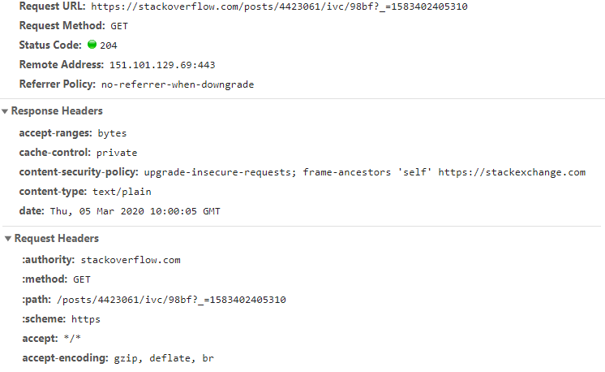

## Исследование HTTP протокола 

1) Найти в интернете 8 различных status code HTTP. В запросе и ответе должно содержаться не менее 5 header’s атрибутов. 

Status 200
```
vagrant@EPUAKHAW013DT11:~$ curl -Is https://stackoverflow.com/questions/14581488/extract-url-from-google | head -n 5
HTTP/2 200
cache-control: private
content-type: text/html; charset=utf-8
last-modified: Mon, 25 Nov 2019 02:38:15 GMT
x-frame-options: SAMEORIGIN
```
Status 404
```
vagrant@EPUAKHAW013DT11:~$ curl -Is https://stackoverflow.com/qu/ | head -n 5
HTTP/2 404
cache-control: private
content-type: text/html; charset=utf-8
x-frame-options: SAMEORIGIN
x-request-guid: f1c091b3-ac89-4ccd-b9d3-e28c9418bbc4
```
Status 301
```
vagrant@EPUAKHAW013DT11:~$ curl -Is http://stackoverflow.com/qu/ | head -n 5
HTTP/1.1 301 Moved Permanently
Content-Type: text/html; charset=utf-8
Location: https://stackoverflow.com/qu/
X-Request-Guid: 42ecd57d-2b43-4af1-90c6-33f6d6b0ffdc
Feature-Policy: microphone 'none'; speaker 'none'
```
Status 405
```
vagrant@EPUAKHAW013DT11:~$ curl -X POST -Is https://web.telegram.org
HTTP/1.1 405 Not Allowed
Server: nginx/1.16.1
Date: Tue, 03 Mar 2020 12:50:04 GMT
Content-Type: text/html
Content-Length: 157
Connection: keep-alive
X-Frame-Options: deny
```
Status 401
```
vagrant@EPUAKHAW013DT11:~$ curl -X GET -Is https://gitlab.com/api/v4/projects/17236085/users?private_token=72BPRFMpK | head -n 5
HTTP/1.1 401 Unauthorized
Server: nginx
Date: Tue, 03 Mar 2020 12:54:31 GMT
Content-Type: application/json
Content-Length: 30
```
Status 400
```
vagrant@EPUAKHAW013DT11:~$ curl -X GET -Is https://ru.wikipedia.org/wiki/%dfgdf | head -n 5
HTTP/2 400
date: Tue, 03 Mar 2020 13:02:45 GMT
content-type: text/html; charset=UTF-8
server: mw1257.eqiad.wmnet
x-powered-by: PHP/7.2.26-1+0~20191218.33+debian9~1.gbpb5a340+wmf1
```
Status 501
```
vagrant@EPUAKHAW013DT11:~$ curl -X PURGE -Is http://10.23.26.135:80 | head -n 5
HTTP/1.1 501 Not Implemented
Date: Tue, 03 Mar 2020 13:13:09 GMT
Server: Apache/2.4.29 (Ubuntu)
Allow: POST,OPTIONS,HEAD,GET
Content-Length: 283
```
Status 202
```
vagrant@EPUAKHAW013DT11:~$ curl -Is -X DELETE --header "Private-Token: 2hQuku5zYXvrgniuFMHL" https://gitlab.com/api/v4/projects/17259462 | head -n 5
HTTP/1.1 202 Accepted
Server: nginx
Date: Tue, 03 Mar 2020 13:27:53 GMT
Content-Type: application/json
Content-Length: 26
```
2) Описать назначение всех атрибутов в client request and server response. На примере одного из HTTP request/response описать все header’s атрибуты. 


```
Response headers:
Connection - Control options for the current connection and list of hop-by-hop response fields.
Content-Length - The length of the request body in octets.
Content-Type - The Media type of the body of the request.
Date - The date and time at which the message was originated.
Keep-Alive - Allows the sender to hint about how the connection may be used to set a timeout and a maximum amount of requests.
Server - A name for the server.

Request headers:
Accept - Media type(s) that is/are acceptable for the response.
Accept-Encoding - List of acceptable encodings.
Accept-Language - List of acceptable human languages for response.
Connection - Control options for the current connection and list of hop-by-hop request fields.
Host - The domain name of the server, and the TCP port number on which the server is listening. The port number may be omitted if the port is the standard port for the service requested.
Upgrade-Insecure-Requests - Tells a server which (presumably in the middle of a HTTP -> HTTPS migration) hosts mixed content that the client would prefer redirection to HTTPS and can handle.
User-Agent - The user agent string of the user agent.
```
3) Найти еще 7 различных status code. Выполнять только после выполнения задания 1. 

Status 204



Status 302


Status 304


Status 101


Status 206


Status 307


Status 403


4) Произвести фильтрацию трафика протокола HTTP с помощью tcpdump. Написать два фильтра: 
- фильтровать по методам протокола HTTP.  
```

```
- фильтровать по методу и header’s атрибуту в response протокола HTTP.
```

```
- фильтровать по методу и header’s атрибуту в request протокола HTTP. 
```

```
5) Используя Fiddler выполнить пункт 4. 
```

```
## Исследование API GitLab
Используя утилиту curl написать запросы: 
1) создание нового проекта
```
https://gitlab.com/api/v4/projects?name=new_project&private_token=<access_token>
curl -X POST --header "Private-Token: <access_token>" https://gitlab.com/api/v4/projects?name=new_project | jq ''
```
2) удаление проекта 
```
https://gitlab.com/api/v4/projects/17236099?private_token=<access_token>
curl -X DELETE --header "Private-Token: <access_token>" https://gitlab.com/api/v4/projects/17243623 | jq ''
```
3) добавления пользователей с различными ролями 
```
https://gitlab.com/api/v4/projects/17236085/members?user_id=3496872&access_level=30&private_token=<access_token>
curl -X POST --header "Private-Token: <access_token>" --data "user_id=3496872&access_level=30" https://gitlab.com/api/v4/projects/17243684/members | jq ''
```
4) создание issue и назначение его определенному пользователю 
```
https://gitlab.com/api/v4/projects/17236085/issues?title=test_issue&assignee_ids=3496872&private_token=<access_token>
curl -X POST --header "Private-Token: <access_token>" --data "title=test_issue&assignee_ids=3496872" https://gitlab.com/api/v4/projects/17243684/issues | jq ''
```
5) получение списка пользователей 
- весь
```
https://gitlab.com/api/v4/projects/17236085/members?private_token=<access_token>
curl -X GET --header "Private-Token: <access_token>" https://gitlab.com/api/v4/projects/17243684/members | jq ''
```
- с определенными правами
```
curl -X GET --header "Private-Token: 2hQuku5zYXvrgniuFMHL" https://gitlab.com/api/v4/projects/17243684/members | jq '.[] | select(.access_level==30)'
```
6) работа с коммитами
- получить список всех комментариев коммита 
```
curl -X GET --header "Private-Token: 2hQuku5zYXvrgniuFMHL" https://gitlab.com/api/v4/projects/17243684/repository/commits/ada258601aaa37b723cdd5f3a34f51d9bc5beab5/comments | jq ''
```
- вставить комментарий в commit в определённую строку от имени пользователя 
```
curl -X POST --header "PRIVATE-TOKEN: 2hQuku5zYXvrgniuFMHL" --data "note=TEST&path=README.md&line=6&line_type=new" https://gitlab.com/api/v4/projects/17243684/repository/commits/f0db5a25a1ee29a2627d5199b2458005b0eb1aad/comments | jq ''
```
Написать скрипты на bash и Python, параметры должны передаваться из командной строки: 
- создать новый проект с заданным именем в определенной группе; 
- добавить/удалить/изменить роль пользователя на проекте; 
- создать/удалить/изменить набор тегов (bug, DEV_env, QA_env, PROD_env, task) для определенного проекта; 
- создать issue (описание, label) для определенного пользователя, до определенной даты и назначить тег (см,). Если label не существует, то создать. If the milestone is not existing, then it should be created. e)Find all actually marge request and create list of problem line. One record of list must consist from: date_time, name_file, number_line, author, description. Proposed use the Linux command printf. 
