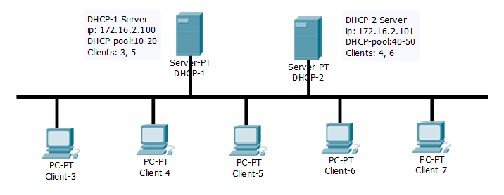

1) Сконфигурировать DHCP-серверы на DHCP-1 и DHCP-2, DHCP-клиенты на Client-3, Client-4,
Client-5, Client-6, Client-7 в соответствии с требованиями спецификации. Client-X должны быть
CentOS 7.4+, Ubuntu 16/18.04.x LST, Windows Server 16 Core or Windows Server 16 Nano.
```
DHCP-1 - Ubuntu 18.04
DHCP-2 - CentOS 7
Client-3 - CentOS 7
Client-4 - CentOS 7
Client-5 - Ubuntu 18.04
Client-6 - Ubuntu 18.04
Client-7 - CentOS 7
```
2) DHCP-1 и DHCP-2 являются DHCP-серверами, выдающими адреса в сети 172.16.nn.0/24 (default
router – 172.16.nn.254), где nn – помер по списку фамилий за алфавитом. Первый выдает
адреса в диапазоне 10-20, второй 40-50. Client-3,5 динамически получает адрес от DHCP-1,
Clent-4,6 динамически получает адрес от DHCP-2.



Client-3
```
[vagrant@EPUAKHAWO13DT18 ~]$ ip a show eth1
3: eth1: <BROADCAST,MULTICAST,UP,LOWER_UP> mtu 1500 qdisc pfifo_fast state UP group default qlen 1000
    link/ether 50:46:5e:6e:8c:18 brd ff:ff:ff:ff:ff:ff
    inet 172.16.2.11/24 brd 172.16.2.255 scope global noprefixroute dynamic eth1
       valid_lft 561sec preferred_lft 561sec
    inet6 fe80::5246:5eff:fe6e:8c18/64 scope link
       valid_lft forever preferred_lft forever
```

3) \*Обеспечить получение арендуемого IP только от "своего" сервера. Обеспечить разумную
конфигурацию всех необходимых параметров стека TCP/IP даже в том случае, когда сервер не
предоставил необходимых данных.

4) Для DHCP-1 и DHCP-2 выдавать сначала динамические адреса, потом фиксированные (по
Ethernet-адресу).

5) Добиться полной коннективности*.

6) Исследовать. Произвести захват пакетов tcpdump-ом (выполнить захват в файл только
необходимых пакетов):
- Первичное получение IP-адреса;
- Произвести настройку с маленьким периодом аренды IP-адреса. Проследить процесс
продления аренды;
- Выключить DHCP сервер и проследить поведения клиентов.
