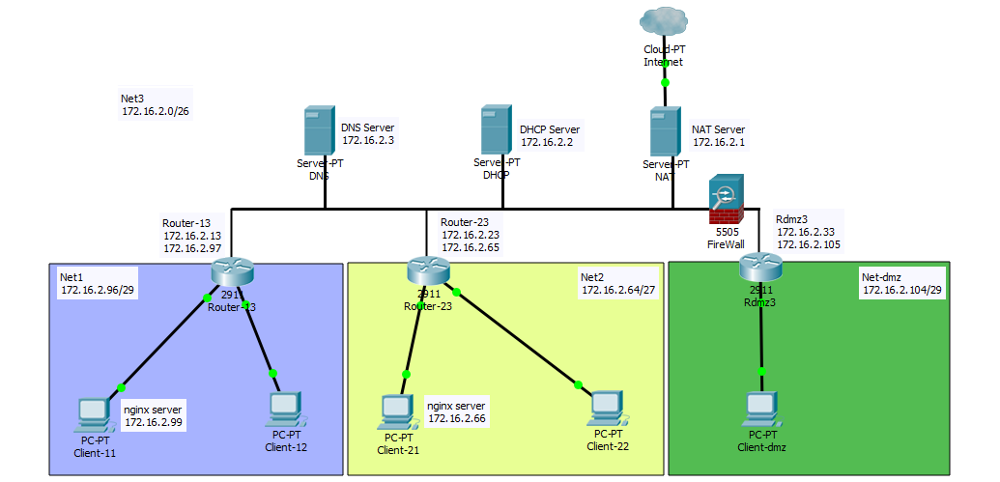

1) Использовать результаты Task-3 и Task-4.
2) Создать 3 сети. Выбрать такие адреса сети, которые позволили бы разместить:
- в первой сети, не боле 6 хостов;
- во второй сети, не более 24 хостов;
- в третьей сети, не более 50 хостов.

Адреса сети выбрать так чтобы количество записей маршрутизации было минимальным.
```
Net1:   172.16.2.96/29
Net2:   172.16.2.64/27
Net3:   172.16.2.0/26
Netdmz: 172.16.2.104/29
```
Сеть имеет следующую топологию:<br>
net 1: подсоединена к сети net3 (отдельный роутер R13 хост с двумя интерфейсами);<br>
net 2: подсоединена к сети net3 (отдельный роутер R23 хост с двумя интерфейсами);<br>
net 3: имеет nat доступ к сети epam;<br>
net-dmz: имеет выход в inet (сеть EPAM) через сеть net 3 (отдельный роутер Rdmz3 хост с
двумя интерфейсами).



3) Настроить:
- один DNS и DHCP;
- настроить nat для доступа в интернет из локальной сети;
- настроить роутинг.
```
NAT Server:  172.16.2.1
DHCP Server: 172.16.2.2
DNS Server:  172.16.2.3
```
4) Настроить на одном из хостов в сетях net1 и net2 сервер nginx. На сервере nginx развернуть
сайт (одна страница, ваше резюме). На DNS настроить Round robin DNS.

Ping test:
```
vagrant@EPUAKHAWO13DT3:~$ ping nginx -c 1 | grep -E -o "([0-9]{1,3}[\.]){3}[0-9]{1,3}" | head -n 1
172.16.2.66
vagrant@EPUAKHAWO13DT3:~$ ping nginx -c 1 | grep -E -o "([0-9]{1,3}[\.]){3}[0-9]{1,3}" | head -n 1
172.16.2.99
vagrant@EPUAKHAWO13DT3:~$ ping nginx -c 1 | grep -E -o "([0-9]{1,3}[\.]){3}[0-9]{1,3}" | head -n 1
172.16.2.66
vagrant@EPUAKHAWO13DT3:~$ ping nginx -c 1 | grep -E -o "([0-9]{1,3}[\.]){3}[0-9]{1,3}" | head -n 1
172.16.2.99
vagrant@EPUAKHAWO13DT3:~$ ping nginx -c 1 | grep -E -o "([0-9]{1,3}[\.]){3}[0-9]{1,3}" | head -n 1
172.16.2.66
vagrant@EPUAKHAWO13DT3:~$ ping nginx -c 1 | grep -E -o "([0-9]{1,3}[\.]){3}[0-9]{1,3}" | head -n 1
172.16.2.66
```
Curl test:
```
vagrant@EPUAKHAWO13DT3:~$ curl nginx
<!DOCTYPE html>
<html>
<head>
<title>Task 5</title>
<style>
    body {
        width: 35em;
        margin: 0 auto;
        font-family: Tahoma, Verdana, Arial, sans-serif;
    }
</style>
</head>
<body>
<h2> You get the answer  from <u>172.16.2.66 </u></h2>

<h1>Welcome to my page!</h1>
<p>I am a future DevOps engineer. (Maybe).</p><br>


<p><em>Thank you for reading my CV.</em></p>
<p><em>Your Oleksandr Frolov ©</em></p>
</body>
</html>
```
```
vagrant@EPUAKHAWO13DT3:~$ curl nginx
<!DOCTYPE html>
<html>
<head>
<title>Task 5</title>
<style>
    body {
        width: 35em;
        margin: 0 auto;
        font-family: Tahoma, Verdana, Arial, sans-serif;
    }
</style>
</head>
<body>
<h2> You get the answer  from <u>172.16.2.99 </u></h2>

<h1>Welcome to my page!</h1>
<p>I am a future DevOps engineer. (Maybe).</p><br>


<p><em>Thank you for reading my CV.</em></p>
<p><em>Your Oleksandr Frolov ©</em></p>
</body>
</html>
```
5) Настроить автоматическую регистрацию DHCP клиентов в DNS сервере.

Forward zone:
```
vagrant@EPUAKHAWO13DT3:~$ cat /var/lib/bind/forward.bind
$ORIGIN .
$TTL 86400      ; 1 day
frolov                  IN SOA  DNS.frolov. root.DNS.frolov. (
                                2014110216 ; serial
                                604800     ; refresh (1 week)
                                86400      ; retry (1 day)
                                2419200    ; expire (4 weeks)
                                604800     ; minimum (1 week)
                                )
                        NS      DNS.frolov.
                        A       172.16.2.3
$ORIGIN frolov.
DHCP                    A       172.16.2.2
DNS                     A       172.16.2.3
$TTL 300        ; 5 minutes
EPUAKHAWO13DT11         A       172.16.2.99
                        TXT     "00647b0b20eee72f318165b7aab873352e"
EPUAKHAWO13DT12         A       172.16.2.100
                        TXT     "008134311960cd14b5e0484e44facdad4d"
EPUAKHAWO13DT13         A       172.16.2.13
                        TXT     "31febc311e6f7923be8264c0a781358458"
EPUAKHAWO13DT21         A       172.16.2.66
                        TXT     "00929faf9d42613da2dabb0717099eb0cc"
EPUAKHAWO13DT22         A       172.16.2.68
                        TXT     "006a368f7750b4d455ea3aa7bf19bd3c73"
EPUAKHAWO13DT23         A       172.16.2.23
                        TXT     "00476175d29aac97026caefc027089b38f"
$TTL 86400      ; 1 day
NAT                     A       172.16.2.1
$TTL 300        ; 5 minutes
nginx                   A       172.16.2.66
                        A       172.16.2.99
```
Reverse zone:
```
vagrant@EPUAKHAWO13DT3:~$ cat /var/lib/bind/reverse.bind
$ORIGIN .
$TTL 86400      ; 1 day
2.16.172.in-addr.arpa   IN SOA  DNS.frolov. root.DNS.frolov. (
                                2014110213 ; serial
                                604800     ; refresh (1 week)
                                86400      ; retry (1 day)
                                2419200    ; expire (4 weeks)
                                604800     ; minimum (1 week)
                                )
                        NS      DNS.frolov.
$ORIGIN 2.16.172.in-addr.arpa.
1                       PTR     NAT.frolov.
$TTL 300        ; 5 minutes
100                     PTR     EPUAKHAWO13DT12.frolov.
13                      PTR     EPUAKHAWO13DT13.frolov.
$TTL 86400      ; 1 day
2                       PTR     DHCP.frolov.
$TTL 300        ; 5 minutes
23                      PTR     EPUAKHAWO13DT23.frolov.
$TTL 86400      ; 1 day
3                       PTR     DNS.frolov.
$TTL 300        ; 5 minutes
66                      PTR     EPUAKHAWO13DT21.frolov.
68                      PTR     EPUAKHAWO13DT22.frolov.
99                      PTR     EPUAKHAWO13DT11.frolov.
```
