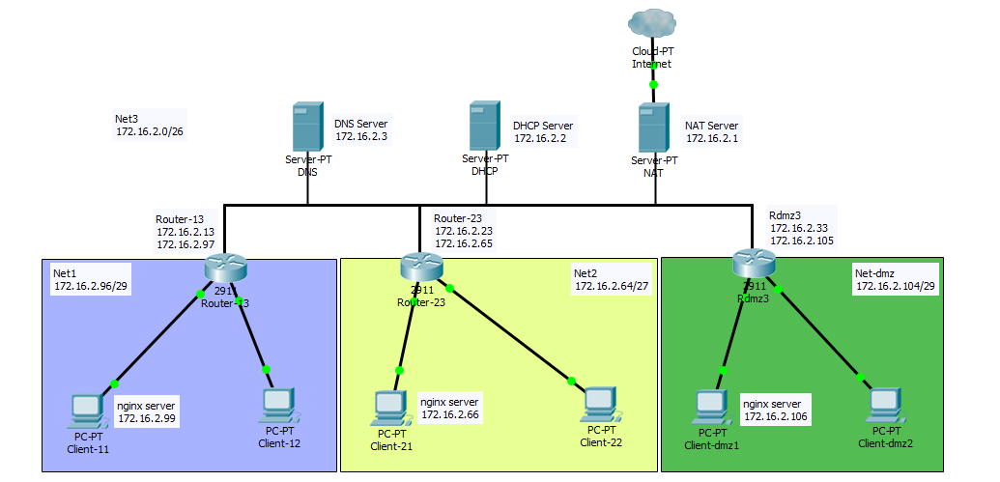

1) Использовать результаты Task-3 и Task-4.
2) Создать 3 сети. Выбрать такие адреса сети, которые позволили бы разместить:
- в первой сети, не боле 6 хостов;
- во второй сети, не более 24 хостов;
- в третьей сети, не более 50 хостов.

Адреса сети выбрать так чтобы количество записей маршрутизации было минимальным.

Сеть имеет следующую топологию: 
net 1: подсоединена к сети net3 (отдельный роутер R13 хост с двумя интерфейсами); 
net 2: подсоединена к сети net3 (отдельный роутер R23 хост с двумя интерфейсами); 
net 3: имеет nat доступ к сети epam; 
net-dmz: имеет выход в inet (сеть EPAM) через сеть net 3 (отдельный роутер Rdmz3 хост с
двумя интерфейсами).

3) Настроить:
- один DNS и DHCP;
- настроить nat для доступа в интернет из локальной сети;
- настроить роутинг.

4) Настроить на одном из хостов в сетях net1 и net2 сервер nginx. На сервере nginx развернуть
сайт (одна страница, ваше резюме). На DNS настроить Round robin DNS.

5) Настроить автоматическую регистрацию DHCP клиентов в DNS сервере.
